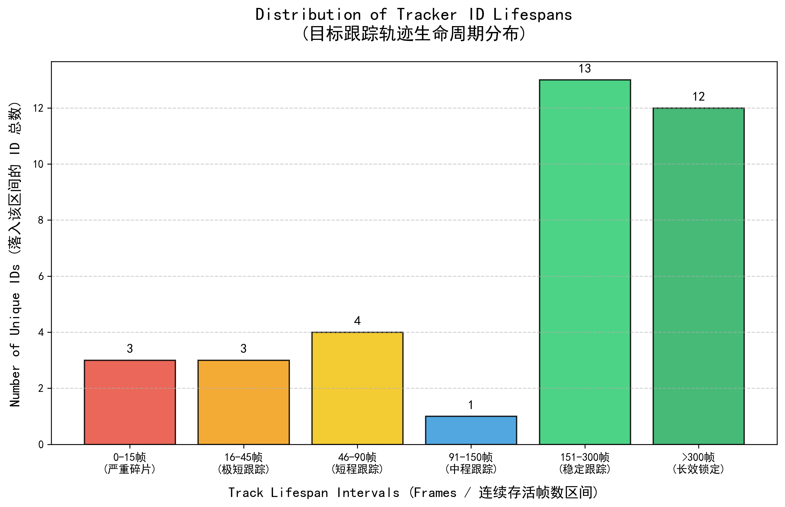

# deepsort-CBAM

基于 **YOLOv5 + DeepSort** 的多目标跟踪（MOT）研究型项目，围绕 **CBAM（Convolutional Block Attention Module）注意力机制** 设计消融实验，并配套完整的实验数据采集、交互演示、定量评估与模型可视化工具链。

- 🎯 **检测**：YOLOv5（`yolov5m` 权重，半精度推理，仅保留 `person` / `car` / `truck` 三类）
- 🔗 **跟踪**：DeepSort（ReID 外观特征 + 级联匹配 + 轨迹管理）
- 🧪 **实验**：跟踪轨迹生命周期（Track Lifespan）定量评估，用于 CBAM 消融对比
- 🖥️ **交互**：具身交互式播放器，支持鼠标 / 键盘锁定目标，并测量端到端渲染延迟
- 🔥 **可视化**：DeepSort ReID 网络的 Grad-CAM 热力图

> ⚠️ **注意**：本仓库仅包含核心脚本与实验素材，**未包含** `models/`、`utils/`、`deep_sort/`、`weights/` 等目录。运行前请先按[「工程骨架」](#工程骨架)一节补齐依赖代码与权重。

---

## 目录结构

```
deepsort-CBAM/
├── AIDetector_pytorch.py        # YOLOv5 检测器封装（Detector 类）
├── demo.py                      # 实时推理演示（检测 + 跟踪 + 可视化）
├── generate_data.py             # 离线批量生成跟踪数据 tracking_data.txt
├── Project_UI.py                # 具身交互界面（目标锁定 + 延迟测量）
├── evaluate_tracking.py         # 轨迹生命周期统计与学术图表生成
├── generate_heatmap.py          # DeepSort ReID 网络 Grad-CAM 热力图
├── requirements.txt             # Python 依赖
├── LICENSE                      # GPL-3.0
├── Ablation_Track_Lifespan.png  # 消融实验：轨迹寿命分布图
├── Ablation_Track_Lifespan(4).png
├── Ablation_Track_Lifespan(5).png
├── heatmap_result(1).jpg        # ReID 网络 Grad-CAM 结果示例
└── result(0).mp4                # 跟踪结果视频示例
```

---

## 环境要求

- Python 3.7+
- PyTorch ≥ 1.7（CUDA 可选，无 GPU 时自动回退 CPU，速度较慢）
- OpenCV

### 安装依赖

```bash
pip install -r requirements.txt
```

`generate_heatmap.py` 额外依赖 Grad-CAM 库：

```bash
pip install pytorch-grad-cam
```

---

## 工程骨架

仓库根目录未上传运行所必需的工程骨架，请将以下内容放入项目根目录：

| 缺失内容 | 说明 | 来源 |
|---|---|---|
| `models/`、`utils/` | YOLOv5 检测网络与工具函数（含 `utils/BaseDetector.py`，提供 `baseDet` 基类） | [ultralytics/yolov5](https://github.com/ultralytics/yolov5) |
| `deep_sort/` | DeepSort 跟踪器包，含 ReID 权重 `deep_sort/deep_sort/deep/checkpoint/ckpt.t7` | [nwojke/deep_sort](https://github.com/nwojke/deep_sort) |
| `weights/yolov5m.pt` | YOLOv5m 检测权重 | 从 [ultralytics/yolov5](https://github.com/ultralytics/yolov5) 下载或自行训练 |

> 本项目基于 [Sharpiless/Yolov5-deepsort-inference](https://github.com/Sharpiless/Yolov5-deepsort-inference) 改造而来，该仓库的结构可作为补齐骨架的完整参考。

---

## 快速开始

### 1. 实时推理演示

```bash
python demo.py
```

逐帧执行检测 + 跟踪并弹窗显示结果，同时将输出保存为 `result.mp4`。

> 脚本默认读取 `E:/c98c8-main/videos/007.avi`（作者本机路径），使用前请修改为本地视频路径。

### 2. 离线生成跟踪数据

```bash
python generate_data.py
```

不渲染画面，仅对视频逐帧推理，把每帧的目标框与跟踪 ID 写入 `tracking_data.txt`，供后续评估与 UI 脚本使用。处理进度每 50 帧打印一次。

> 脚本默认读取 `E:/c98c8-main/videos/test.mp4`，使用前请修改为本地视频路径。

### 3. 具身交互界面

```bash
python Project_UI.py
```

加载 `tracking_data_baseline.txt` 与视频逐帧回放，提供：

- 进度条拖动跳帧，空格键暂停 / 继续
- **鼠标点击**目标框 或 **键盘输入 ID + 回车** 锁定目标（红色粗框高亮，其余目标橙色细框）
- 按 `C` 恢复全局监控，`Q` / `Esc` 退出
- 每次锁定操作自动用 `time.perf_counter()` 测量「指令接收 → 画面渲染」的**真实端到端延迟**并打印（单位 ms），可用于人机交互性能评估

> ⚠️ 注意：脚本实际读取的是 `tracking_data_baseline.txt`（报错提示文案仍写着 `tracking_data.txt`）。如需使用 `generate_data.py` 生成的 `tracking_data.txt`，请改名或修改代码。

### 4. 轨迹寿命评估（消融对比）

```bash
python evaluate_tracking.py
```

读取 `tracking_data.txt`，统计：

- 视频总帧数、系统分配的总 ID 数
- 轨迹平均 / 中位数 / 最长生存寿命
- 有效目标（存活 > 15 帧）平均寿命、极短碎片 ID 占比（ID Switch 指征）

并以 300 DPI 输出学术风格柱状图 `Ablation_Track_Lifespan.png`，按 0-15 / 16-45 / 46-90 / 91-150 / 151-300 / >300 帧六档展示 ID 分布。

> 💡 建议分别对「带 CBAM」「不带 CBAM」两组数据各跑一次本脚本，进行定量对比（仓库内 `Ablation_Track_Lifespan*.png` 即多次实验的结果示例）。

### 5. ReID 网络 Grad-CAM 热力图

```bash
python generate_heatmap.py
```

加载 `deep_sort/deep_sort/deep/checkpoint/ckpt.t7`（ReID 网络 `Net(num_classes=751)`），对当前目录下的 `test_person.jpg` 生成以 `layer4[-1]` 为靶向层的 Grad-CAM 热力图，保存为 `heatmap_result.jpg`，用于分析模型关注区域。

---

## 数据格式

`tracking_data.txt` / `tracking_data_baseline.txt` 为纯文本，每行一条记录：

```
帧号, 跟踪ID, x1, y1, x2, y2
```

示例：

```
0,1,320,180,412,360
0,2,512,240,600,420
1,1,322,181,410,358
```

---

## API 使用

### 初始化检测器

```python
from AIDetector_pytorch import Detector

det = Detector()
```

### 单帧检测 + 跟踪

```python
func_status = {'headpose': None}
result = det.feedCap(im, func_status)

frame = result['frame']         # 可视化后的 BGR 图像
bboxes = result['face_bboxes']  # 当前帧目标列表：(x1, y1, x2, y2, 类别, 跟踪ID)
```

### 检测器说明（AIDetector_pytorch.py）

- 自动选择设备：`cuda:0`（可用时）/ `cpu`
- 加载 `weights/yolov5m.pt` 并切换半精度（`model.half()`）
- 预处理：letterbox 缩放 → BGR2RGB → HWC2CHW → 归一化
- 后处理：NMS（`conf_thres=0.25`，`iou_thres=0.55`），仅保留 `person`、`car`、`truck` 三个类别

```python
class Detector(baseDet):

    def __init__(self):
        super(Detector, self).__init__()
        self.init_model()
        self.build_config()

    def init_model(self):
        self.weights = 'weights/yolov5m.pt'
        self.device = '0' if torch.cuda.is_available() else 'cpu'
        self.device = select_device(self.device)
        model = attempt_load(self.weights, map_location=self.device)
        model.to(self.device).eval()
        model.half()
        self.m = model
        self.names = model.module.names if hasattr(
            model, 'module') else model.names

    def preprocess(self, img):
        img0 = img.copy()
        img = letterbox(img, new_shape=self.img_size)[0]
        img = img[:, :, ::-1].transpose(2, 0, 1)
        img = np.ascontiguousarray(img)
        img = torch.from_numpy(img).to(self.device)
        img = img.half()   # 半精度
        img /= 255.0       # 图像归一化
        if img.ndimension() == 3:
            img = img.unsqueeze(0)
        return img0, img

    def detect(self, im):
        im0, img = self.preprocess(im)
        pred = self.m(img, augment=False)[0]
        pred = pred.float()
        pred = non_max_suppression(pred, conf_thres=0.25, iou_thres=0.55)
        # ... 坐标映射回原图，仅保留 person / car / truck
        return im, pred_boxes
```

---

## 实验素材

| 素材 | 说明 |
|---|---|
| `Ablation_Track_Lifespan.png` | 轨迹寿命分布柱状图（0-15 / 16-45 / 46-90 / 91-150 / 151-300 / >300 帧） |
| `Ablation_Track_Lifespan(4).png` | 消融实验另一组结果 |
| `Ablation_Track_Lifespan(5).png` | 消融实验另一组结果 |
| `heatmap_result(1).jpg` | ReID 网络 Grad-CAM 热力图示例 |
| `result(0).mp4` | 跟踪结果视频示例 |




---

## 已知说明

- 各脚本中的视频路径（如 `E:/c98c8-main/videos/007.avi`）为作者本机绝对路径，使用前请替换为本地路径。
- 仓库名中的 **CBAM** 指实验主题（在检测 / ReID 网络中引入 CBAM 注意力模块），其实现代码未随仓库根目录上传，需自行在 `deep_sort` / `models` 中集成。
- `Project_UI.py` 读取的是 `tracking_data_baseline.txt`，与 `generate_data.py` 输出的文件名不一致，请按需调整。

---

## 许可证

本项目基于 **GNU General Public License v3.0** 发布（见 [LICENSE](LICENSE)）。

- 目标检测部分来源于 [ultralytics/yolov5](https://github.com/ultralytics/yolov5)（GPL-3.0）
- 多目标跟踪部分来源于 [nwojke/deep_sort](https://github.com/nwojke/deep_sort)（GPL-3.0）
- 项目框架参考 [Sharpiless/Yolov5-deepsort-inference](https://github.com/Sharpiless/Yolov5-deepsort-inference)（GPL-3.0）
